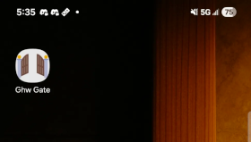
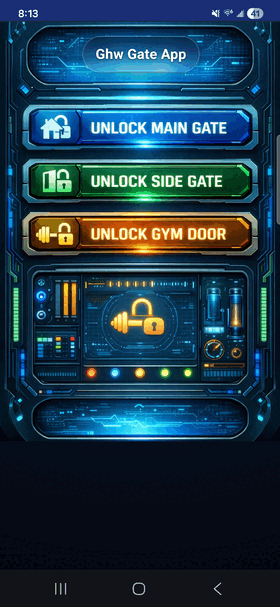

# Gatewise Spoof

Create a fake Gatewise app I can share with family that will let them open the gate to my apartment complex

## Repository layout

- docs/TODO.txt - TODO list from beginning of project to end
- pki - MITM PKI generation script
- nginx - MITM docker compose project w/ python proxy
- logs - Various artifacts from reverse engineering
- curl - PoC in curl
- apk - Gatewise app source (Removed to reduce repo size)
- www - The html/js app to open the gate (Requires embedding %REFRESH_TOKEN% with real value)
- imgs - Workspace for making and manipulating images
- build-php.sh - Embed the refresh token into the html/js file and wrap it in a PHP password protection

## Secrets

Once you get the Gatewise firebase API key, put it in ./secrets/web-api-key.txt

Once you get the Firebase ID refresh token, put it in ./secrets/refresh-token.txt

## Production

Running ./compile.sh will build the final PHP file with the refresh token embedded and a random password required to access

Ship the www to /gate/ on your PHP host and then access it at /gate?pw=${random-password}
